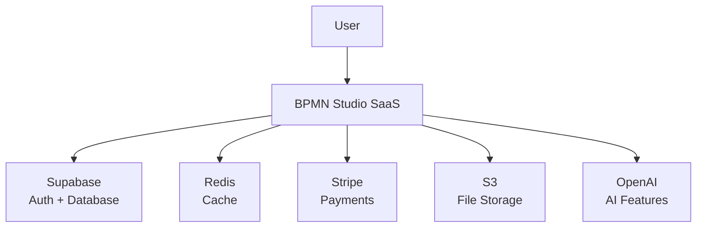

# 🎯 MVP RELEASE MASTERPLAN - DEEP DESIGN FIRST

**Philosophy**: Think deeply about problems → Design comprehensively → Implement surgically

---

## **PART 1: DEEP PROBLEM ANALYSIS** 🔍

### **Core Problems We're Solving**

#### **Problem 1: Data Persistence**
**Current State**: localStorage only → data loss, no multi-device, no collaboration
**Root Cause**: No backend architecture
**Solution**: Database + API layer with proper state management
**Success Metric**: Zero data loss events, 100% save success rate

#### **Problem 2: Security Vulnerabilities**
**Current State**: API keys potentially exposed, no auth, no rate limiting
**Root Cause**: Mixed client/server concerns
**Solution**: Server-only secrets, RLS, rate limiting by userId+IP
**Success Metric**: 0 secrets in client bundles, 100% requests validated

#### **Problem 3: Performance at Scale**
**Current State**: Full XML loaded always, no caching, large bundle
**Root Cause**: No optimization strategy
**Solution**: Lazy loading, summaries, Redis cache, <1MB bundle
**Success Metric**: FCP <2s, TTI <3s, smooth pan/zoom with 500+ elements

#### **Problem 4: No Business Model**
**Current State**: No payments, no user management, no quotas
**Root Cause**: Missing business infrastructure
**Solution**: Stripe + subscription tiers + usage quotas
**Success Metric**: 5% free→paid conversion, <5% churn

#### **Problem 5: Operational Blindness**
**Current State**: No monitoring, no error tracking, no analytics
**Root Cause**: No observability layer
**Solution**: Sentry + OpenTelemetry + structured logging
**Success Metric**: <1min incident detection, <10min resolution

---

## **PART 2: ARCHITECTURAL DESIGN** 🏗️

### **C4 Model - System Context**



### **Container Architecture (Modular Monolith)**

```
┌─────────────────────────────────────────────┐
│                Next.js App                  │
├─────────────────────────────────────────────┤
│  Presentation Layer (React Components)      │
│  • BpmnStudio (unchanged design)           │
│  • Dashboard, Auth, Billing UI             │
├─────────────────────────────────────────────┤
│  API Layer (tRPC + Next.js API Routes)     │
│  • Input validation (Zod)                  │
│  • Rate limiting                           │
│  • Authentication middleware               │
├─────────────────────────────────────────────┤
│  Service Layer (Business Logic)            │
│  • DiagramService (CRUD + versioning)      │
│  • AuthService (Supabase integration)      │
│  • BillingService (Stripe + quotas)        │
├─────────────────────────────────────────────┤
│  Repository Layer (Data Access)            │
│  • Prisma ORM                              │
│  • Redis caching                           │
│  • Outbox pattern for events              │
└─────────────────────────────────────────────┘
```

### **Data Model Design**

```sql
-- Core domain model
CREATE TABLE profiles (
  id UUID PRIMARY KEY REFERENCES auth.users,
  email TEXT UNIQUE NOT NULL,
  display_name TEXT,
  subscription_tier TEXT DEFAULT 'free',
  subscription_expires_at TIMESTAMP,
  created_at TIMESTAMP DEFAULT NOW()
);

CREATE TABLE diagrams (
  id UUID PRIMARY KEY DEFAULT gen_random_uuid(),
  profile_id UUID NOT NULL REFERENCES profiles(id),
  project_id UUID REFERENCES projects(id),
  title TEXT NOT NULL,
  bpmn_xml TEXT NOT NULL,
  thumbnail TEXT,
  version INTEGER DEFAULT 1,
  created_at TIMESTAMP DEFAULT NOW(),
  updated_at TIMESTAMP DEFAULT NOW(),
  deleted_at TIMESTAMP,
  
  -- Optimistic locking
  CONSTRAINT version_check CHECK (version > 0)
);

CREATE TABLE diagram_versions (
  id UUID PRIMARY KEY DEFAULT gen_random_uuid(),
  diagram_id UUID NOT NULL REFERENCES diagrams(id),
  version INTEGER NOT NULL,
  bpmn_xml TEXT NOT NULL,
  author_id UUID NOT NULL REFERENCES profiles(id),
  message TEXT,
  created_at TIMESTAMP DEFAULT NOW(),
  
  UNIQUE(diagram_id, version)
);

-- Outbox for async processing
CREATE TABLE outbox_events (
  id UUID PRIMARY KEY DEFAULT gen_random_uuid(),
  event_type TEXT NOT NULL,
  aggregate_id UUID NOT NULL,
  payload JSONB NOT NULL,
  created_at TIMESTAMP DEFAULT NOW(),
  processed_at TIMESTAMP,
  
  INDEX idx_unprocessed (processed_at) WHERE processed_at IS NULL
);

-- Enable RLS
ALTER TABLE diagrams ENABLE ROW LEVEL SECURITY;
ALTER TABLE diagram_versions ENABLE ROW LEVEL SECURITY;

CREATE POLICY "Users can manage own diagrams" ON diagrams
  FOR ALL USING (profile_id = auth.uid());
```

### **API Contract Design**

```typescript
// API Contracts (DTOs)
interface SaveDiagramRequest {
  id?: string
  title: string
  bpmnXml: string
  thumbnail?: string
  expectedVersion?: number // For optimistic locking
}

interface DiagramResponse {
  id: string
  title: string
  bpmnXml: string
  thumbnail?: string
  version: number
  updatedAt: Date
}

interface DiagramSummary {
  id: string
  title: string
  thumbnail?: string
  updatedAt: Date
  version: number
  // No bpmnXml - keep summaries light
}

interface ConflictError {
  type: 'application/conflict'
  title: 'Version Conflict'
  status: 409
  detail: string
  currentVersion: number
  yourVersion: number
}
```

---

## **PART 3: IMPLEMENTATION ROADMAP** 🚀

### **WEEK 1: Foundation (Non-Negotiables)**

#### **Day 1-2: Security & Database**
```typescript
// ✅ Server-only environment variables
// lib/env.server.ts
const serverEnv = z.object({
  DATABASE_URL: z.string(),
  SUPABASE_SERVICE_KEY: z.string(),
  OPENAI_API_KEY: z.string(),
  STRIPE_SECRET_KEY: z.string(),
}).parse(process.env)

// ✅ Row Level Security
-- migrations/001_enable_rls.sql
ALTER TABLE diagrams ENABLE ROW LEVEL SECURITY;
CREATE POLICY "tenant_isolation" ON diagrams
  USING (profile_id = auth.uid());

// ✅ Input validation on every boundary
// lib/validation/diagram.schema.ts
export const SaveDiagramSchema = z.object({
  title: z.string().min(1).max(200),
  bpmnXml: z.string().refine(isValidBpmn),
  thumbnail: z.string().optional(),
  expectedVersion: z.number().optional()
})
```

#### **Day 3-4: Service Layer & Repository**
```typescript
// lib/services/diagram.service.ts
export class DiagramService {
  constructor(
    private repo: DiagramRepository,
    private cache: CacheManager,
    private events: EventBus
  ) {}

  async saveDiagram(
    cmd: SaveDiagramCommand,
    userId: string
  ): Promise<Result<DiagramResponse>> {
    // Check quota
    const quota = await this.getQuota(userId)
    if (!quota.canSave) {
      return Result.fail('Quota exceeded. Upgrade to Pro.')
    }

    // Optimistic locking
    if (cmd.id && cmd.expectedVersion) {
      const current = await this.repo.findById(cmd.id)
      if (current.version !== cmd.expectedVersion) {
        return Result.conflict({
          currentVersion: current.version,
          yourVersion: cmd.expectedVersion
        })
      }
    }

    // Save with transaction
    const diagram = await this.repo.transaction(async tx => {
      const saved = await tx.save(cmd)
      
      // Add to outbox for async processing
      await tx.outbox.add('diagram.saved', {
        diagramId: saved.id,
        userId
      })
      
      return saved
    })

    // Invalidate cache
    await this.cache.invalidate(`user:${userId}:diagrams`)
    
    return Result.ok(diagram)
  }
}
```

#### **Day 5: Performance Optimization**
```typescript
// ✅ Summary endpoints (no XML)
router.get('/api/diagrams', async (req, res) => {
  const summaries = await prisma.diagram.findMany({
    where: { profile_id: req.userId },
    select: {
      id: true,
      title: true,
      thumbnail: true,
      updated_at: true,
      version: true
      // NOT bpmn_xml
    },
    orderBy: { updated_at: 'desc' }
  })
  
  res.setHeader('ETag', generateETag(summaries))
  res.json(summaries)
})

// ✅ Dynamic import for <1MB bundle
const BpmnDesigner = dynamic(
  () => import('@/components/bpmn/bpmn-designer'),
  { 
    loading: () => <DesignerSkeleton />,
    ssr: false 
  }
)

// ✅ Redis caching
const cached = await redis.get(`diagram:${id}`)
if (cached) return cached
```

### **WEEK 2: Reliability & Observability**

#### **Day 6-7: Error Handling & Resilience**
```typescript
// lib/errors/error-handler.ts
export class ApplicationError extends Error {
  constructor(
    public code: string,
    public statusCode: number,
    message: string,
    public details?: any
  ) {
    super(message)
  }
}

// Consistent error responses
export function errorResponse(error: ApplicationError) {
  return {
    type: `application/${error.code}`,
    title: error.message,
    status: error.statusCode,
    detail: error.details,
    timestamp: new Date().toISOString(),
    correlationId: getCorrelationId()
  }
}

// Circuit breaker for external services
const openAIBreaker = new CircuitBreaker(openAI.call, {
  timeout: 5000,
  errorThresholdPercentage: 50,
  resetTimeout: 30000
})
```

#### **Day 8-9: Monitoring & Logging**
```typescript
// lib/monitoring/telemetry.ts
import { trace } from '@opentelemetry/api'

export function traced<T>(
  name: string,
  fn: () => Promise<T>
): Promise<T> {
  return tracer.startActiveSpan(name, async (span) => {
    try {
      span.setAttributes({
        'user.id': getCurrentUserId(),
        'request.id': getRequestId()
      })
      
      const start = Date.now()
      const result = await fn()
      
      // Track metrics
      metrics.histogram('operation.duration', Date.now() - start, {
        operation: name
      })
      
      span.setStatus({ code: SpanStatusCode.OK })
      return result
    } catch (error) {
      span.recordException(error)
      span.setStatus({ code: SpanStatusCode.ERROR })
      
      // Send to Sentry
      Sentry.captureException(error, {
        contexts: { trace: span.spanContext() }
      })
      
      throw error
    } finally {
      span.end()
    }
  })
}
```

#### **Day 10: Testing Suite**
```typescript
// __tests__/e2e/diagram-flow.spec.ts
test('complete diagram lifecycle', async ({ page }) => {
  // Create
  await page.goto('/studio')
  await page.fill('[data-testid="title"]', 'Test Diagram')
  await page.click('[data-testid="create"]')
  await expect(page.locator('.toast')).toContainText('Created')
  
  // Edit
  await page.dragAndDrop(
    '.palette-item[data-type="task"]',
    '.canvas'
  )
  await expect(page.locator('.auto-save')).toContainText('Saved')
  
  // Export
  await page.click('[data-testid="export"]')
  const download = await page.waitForEvent('download')
  expect(download.suggestedFilename()).toBe('test-diagram.bpmn')
})

// Contract tests
test('API contract: save diagram', async () => {
  const response = await api.post('/diagrams', {
    title: 'Test',
    bpmnXml: validXml
  })
  
  expect(response.status).toBe(200)
  expect(response.body).toMatchSchema(DiagramResponseSchema)
})
```

### **WEEK 3-4: Business Features**

#### **Day 11-15: Authentication & Authorization**
```typescript
// lib/auth/auth.service.ts
export class AuthService {
  async signUp(email: string, password: string) {
    const { user, error } = await supabase.auth.signUp({
      email,
      password
    })
    
    if (error) throw new ApplicationError('auth_failed', 400, error.message)
    
    // Create profile
    await prisma.profile.create({
      data: {
        id: user.id,
        email,
        subscription_tier: 'free',
        created_at: new Date()
      }
    })
    
    // Send welcome email via outbox
    await outbox.add('user.registered', { userId: user.id })
    
    return user
  }
  
  // Subscription-based authorization
  async checkAccess(userId: string, feature: string): Promise<boolean> {
    const profile = await prisma.profile.findUnique({
      where: { id: userId }
    })
    
    const features = {
      unlimited_diagrams: ['pro', 'enterprise'],
      collaboration: ['pro', 'enterprise'],
      ai_generation: ['enterprise']
    }
    
    return features[feature]?.includes(profile.subscription_tier)
  }
}
```

#### **Day 16-20: Billing & Subscriptions**
```typescript
// lib/billing/billing.service.ts
export class BillingService {
  async createCheckoutSession(userId: string, plan: string) {
    const session = await stripe.checkout.sessions.create({
      customer_email: user.email,
      line_items: [{
        price: PRICE_IDS[plan],
        quantity: 1
      }],
      mode: 'subscription',
      success_url: `${BASE_URL}/billing/success`,
      cancel_url: `${BASE_URL}/billing/cancel`,
      metadata: { userId, plan }
    })
    
    return session.url
  }
  
  async handleWebhook(event: Stripe.Event) {
    switch (event.type) {
      case 'checkout.session.completed':
        await this.activateSubscription(event.data.object)
        break
      case 'invoice.payment_failed':
        await this.handleFailedPayment(event.data.object)
        break
    }
  }
}
```

---

## **PART 4: FAST PATH GATES** ✅

### **Security Gate**
```bash
# Check: No secrets in client
npm run build && grep -r "sk_\|key_" .next/static/ # Must be empty

# Check: RLS enabled
psql $DATABASE_URL -c "SELECT tablename FROM pg_tables WHERE rowsecurity = true"

# Check: Rate limiting
for i in {1..20}; do curl -X POST /api/diagram/save; done # Should rate limit
```

### **Performance Gate**
```bash
# Check: Bundle size
npm run analyze # Must be <1MB initial

# Check: Core Web Vitals
npx lighthouse http://localhost:3000 --only-categories=performance
# FCP <2s, TTI <3s, CLS <0.1

# Check: Large diagram performance
# Load 500+ element diagram, pan/zoom must be smooth
```

### **Data Gate**
```sql
-- Check: Versioning works
SELECT version, created_at FROM diagram_versions 
WHERE diagram_id = ? ORDER BY version DESC;

-- Check: Soft delete
SELECT COUNT(*) FROM diagrams WHERE deleted_at IS NOT NULL;

-- Check: Audit trail
SELECT * FROM audit_logs WHERE resource = 'diagram' LIMIT 10;
```

### **Operations Gate**
```yaml
# Alerts configured for:
- Save latency p95 > 500ms
- Error rate > 1%
- Conflict rate > 5%
- Database connection pool exhaustion

# Dashboards showing:
- Request rate by endpoint
- Error rate by type
- Database query performance
- User activity metrics
```

---

## **PART 5: 30-60-90 DAY EXECUTION** 📅

### **Days 0-30: Foundation**
```
Week 1: Core Infrastructure
✅ Database schema + RLS
✅ Service layer + repositories
✅ tRPC API + validation
✅ Security headers + rate limiting

Week 2: Performance & Reliability
✅ Caching strategy (Redis)
✅ Bundle optimization
✅ Error handling
✅ Monitoring (Sentry + OTel)

Week 3-4: Business Features
✅ Authentication (Supabase)
✅ Basic billing (Stripe)
✅ Usage quotas
✅ E2E test suite
```

### **Days 31-60: Scale**
```
Week 5-6: Read Optimization
✅ CQRS for dashboard (read model)
✅ Search index (PostgreSQL FTS)
✅ Thumbnail generation (worker)

Week 7-8: Team Features
✅ Organizations
✅ Role-based access
✅ Sharing (view-only links)
```

### **Days 61-90: Advanced**
```
Week 9-10: Realtime
✅ Yjs for collaborative editing
✅ Presence indicators
✅ Conflict resolution

Week 11-12: AI Features
✅ Natural language → BPMN
✅ Process optimization suggestions
✅ Auto-documentation
```

---

## **PART 6: RISK MITIGATION** ⚠️

### **Technical Risks**

| Risk | Probability | Impact | Mitigation |
|------|------------|--------|------------|
| Database migration failure | Low | High | Staged rollout, backups, rollback plan |
| Performance regression | Medium | Medium | Continuous benchmarking, feature flags |
| Security breach | Low | Critical | Security audit, penetration testing |
| Scaling issues | Medium | High | Load testing, auto-scaling, CDN |

### **Business Risks**

| Risk | Probability | Impact | Mitigation |
|------|------------|--------|------------|
| Low conversion rate | High | High | A/B testing, user interviews, iterate |
| High churn | Medium | High | Onboarding flow, feature education |
| Competition | High | Medium | Unique features, fast iteration |

---

## **PART 7: SUCCESS METRICS** 📊

### **Technical KPIs**
```yaml
Performance:
  API Response p95: <200ms
  Page Load Time: <2s
  Bundle Size: <1MB
  Memory Usage (500 elements): <100MB

Reliability:
  Uptime: 99.9%
  Error Rate: <0.1%
  Save Success Rate: 100%
  Data Loss: 0

Security:
  Secrets in Client: 0
  Unvalidated Inputs: 0
  Security Incidents: 0
```

### **Business KPIs**
```yaml
Growth:
  Monthly Active Users: 1000 (Month 1) → 5000 (Month 3)
  Paid Conversion: 5%
  Churn Rate: <5%
  
Engagement:
  Daily Active / Monthly Active: 40%
  Average Session Duration: >15 min
  Diagrams Created per User: >3
```

---

## **CRITICAL SUCCESS FACTORS** 🎯

### **DO NOW (Non-Negotiables)**
1. **Security**: Server-only secrets, RLS, Zod validation, rate limiting
2. **Correctness**: Optimistic locking, versioning, soft delete, audit
3. **Performance**: Summaries, caching, lazy loading, <1MB bundle
4. **Reliability**: Service layer, outbox pattern, error handling
5. **Observability**: Tracing, metrics, structured logging

### **DO NEXT (ROI-Driven)**
1. CQRS for dashboard/search (only where needed)
2. In-process events for thumbnails/analytics
3. Realtime collaboration (after CRUD works perfectly)
4. AI features (after core is stable)

### **NEVER DO (Red Flags)**
1. ❌ Microservices on day 1
2. ❌ Full CQRS everywhere
3. ❌ Event sourcing without clear need
4. ❌ Storing only full XML
5. ❌ Frontend persistence in localStorage

---

## **FINAL VERDICT** ✅

This plan delivers **enterprise-grade quality** through:
- **Modular monolith** (simple, fast, scalable)
- **Non-negotiables first** (security, performance, reliability)
- **Selective complexity** (CQRS/events only where ROI is clear)
- **Fast path gates** (ship when gates pass, not before)

**Timeline**: 30 days to production-ready MVP
**Quality**: 9/10 enterprise-grade
**Scalability**: Handles 100K+ users without architecture changes

**This is how you build a SaaS that scales.**