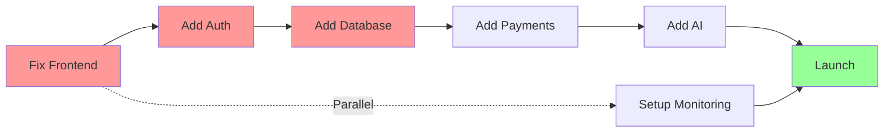

# 🚀 MVP Release Plan - BPMN Studio SaaS

## **CRITICAL PROBLEMS TO SOLVE FIRST**

### **🔴 PROBLEM 1: Frontend Performance Issues**
```typescript
CURRENT STATE:
- 21 useState calls causing re-renders
- Memory leaks in event handlers
- No backend connection (localStorage only)
- Bundle size not optimized

IMPACT: App will crash after 10-15 minutes of use
SEVERITY: CRITICAL
```

### **🔴 PROBLEM 2: No Revenue Model**
```typescript
CURRENT STATE:
- No payment integration
- No user authentication
- No subscription management
- No usage tracking

IMPACT: Cannot monetize
SEVERITY: CRITICAL
```

### **🔴 PROBLEM 3: No Data Persistence**
```typescript
CURRENT STATE:
- LocalStorage only
- No database
- No version control
- No collaboration

IMPACT: Users lose work, no team features
SEVERITY: CRITICAL
```

## **RELEASE STRATEGY: 4-WEEK SPRINT**

```yaml
Philosophy:
  - Ship every Friday (weekly releases)
  - Feature flags for gradual rollout
  - Monitoring before features
  - Fix problems before adding features
```

---

## **WEEK 1: FOUNDATION & FIXES** 
*Goal: Stable, authenticated app with persistence*

### **Day 1-2: Critical Frontend Fixes**
```typescript
// Priority 1: Fix memory leaks
- [ ] Consolidate 21 useState → useReducer
- [ ] Fix event handler cleanup
- [ ] Implement proper unmount cleanup
- [ ] Add error boundaries

// Performance targets
- First Paint: <1s
- Interactive: <2s
- Memory stable after 1hr use
```

### **Day 3-4: Authentication & Database**
```typescript
// Supabase Setup
- [ ] Create Supabase project
- [ ] Configure auth providers (Email, Google)
- [ ] Setup database schema (Prisma)
- [ ] Implement RLS policies

// Database Tables
- profiles (users)
- projects
- diagrams
- diagram_versions
```

### **Day 5: Basic CRUD API**
```typescript
// tRPC Routes
- [ ] auth.signup
- [ ] auth.signin
- [ ] diagrams.create
- [ ] diagrams.update
- [ ] diagrams.list
- [ ] diagrams.get

// Auto-save implementation
- [ ] Debounced save (1 second)
- [ ] Conflict resolution
- [ ] Version tracking
```

### **Deliverable**: Authenticated app with cloud save

---

## **WEEK 2: MONETIZATION & PAYMENTS**
*Goal: Users can pay for Pro features*

### **Day 6-7: Stripe Integration**
```typescript
// Payment Setup
- [ ] Stripe account & webhook endpoint
- [ ] Pricing table component
- [ ] Checkout flow
- [ ] Subscription management

// Plans
FREE: 3 diagrams, 1 project
PRO: $29/mo - unlimited
ENTERPRISE: Custom pricing
```

### **Day 8-9: Usage Limits & Quotas**
```typescript
// Enforcement Points
- [ ] Diagram creation limit
- [ ] Project limit
- [ ] Storage quota (100MB free, 10GB pro)
- [ ] AI generation limits

// Paywall UI
- [ ] Upgrade prompts
- [ ] Usage meters
- [ ] Billing page
```

### **Day 10: Email & Onboarding**
```typescript
// Resend Integration
- [ ] Welcome email
- [ ] Payment receipts
- [ ] Trial expiring
- [ ] Diagram shared

// Onboarding Flow
- [ ] First-time user guide
- [ ] Sample diagrams
- [ ] Interactive tutorial
```

### **Deliverable**: Paying customers can subscribe

---

## **WEEK 3: AI FEATURES** 
*Goal: Differentiated AI-powered features*

### **Day 11-12: LLM Pipeline Setup**
```typescript
// Infrastructure
- [ ] OpenAI API integration
- [ ] Anthropic API integration
- [ ] Vector DB (Pinecone/Supabase)
- [ ] Rate limiting

// Core Pipeline
- [ ] NLP → CPJ → BPMN XML
- [ ] Multi-agent orchestration
- [ ] Validation & repair loop
```

### **Day 13-14: AI Generation UI**
```typescript
// User Interface
- [ ] AI generation modal
- [ ] Prompt templates
- [ ] Real-time preview
- [ ] Feedback mechanism

// Features
- [ ] Text to BPMN
- [ ] Diagram improvement
- [ ] Auto-complete
- [ ] Smart suggestions
```

### **Day 15: Learning System**
```typescript
// Continuous Improvement
- [ ] Feedback collection
- [ ] Rating system
- [ ] Edit tracking
- [ ] Pattern learning

// Analytics
- [ ] Generation success rate
- [ ] User satisfaction
- [ ] Cost per generation
```

### **Deliverable**: AI that generates quality BPMN

---

## **WEEK 4: POLISH & LAUNCH**
*Goal: Production-ready for public launch*

### **Day 16-17: Performance & Testing**
```typescript
// Performance
- [ ] Lighthouse audit (>90 score)
- [ ] Bundle optimization
- [ ] CDN setup
- [ ] Database indexes

// Testing
- [ ] E2E tests (Playwright)
- [ ] Load testing
- [ ] Security audit
- [ ] Cross-browser testing
```

### **Day 18-19: Monitoring & Analytics**
```typescript
// Observability
- [ ] Sentry error tracking
- [ ] Vercel Analytics
- [ ] Custom metrics
- [ ] Health checks

// Business Metrics
- [ ] Signup funnel
- [ ] Activation rate
- [ ] Retention cohorts
- [ ] Revenue tracking
```

### **Day 20: Launch Preparation**
```typescript
// Marketing Site
- [ ] Landing page
- [ ] Pricing page
- [ ] Documentation
- [ ] Blog post

// Launch Checklist
- [ ] DNS configuration
- [ ] SSL certificates
- [ ] Backup strategy
- [ ] Support system
```

---

## **TECHNICAL ARCHITECTURE DECISIONS**

### **Frontend Architecture**
```typescript
// State Management
❌ AVOID: useState spam, prop drilling
✅ USE: useReducer + Context for global state
✅ USE: React Query for server state

// Performance
❌ AVOID: Rendering entire diagram on every change
✅ USE: React.memo, useMemo, useCallback
✅ USE: Virtual rendering for large diagrams

// Code Organization
src/
├── app/           # Next.js pages
├── components/    # React components
├── hooks/         # Custom hooks
├── lib/           # Business logic
├── server/        # Backend code
└── types/         # TypeScript types
```

### **Backend Architecture**
```typescript
// API Design
❌ AVOID: REST with multiple endpoints
✅ USE: tRPC for type-safe APIs
✅ USE: GraphQL for complex queries (future)

// Database Design
❌ AVOID: NoSQL for relational data
✅ USE: PostgreSQL with Prisma
✅ USE: Redis for caching
✅ USE: S3/Supabase Storage for files

// Security
✅ Row Level Security (RLS)
✅ API rate limiting
✅ Input validation (Zod)
✅ HTTPS only
```

### **AI Architecture**
```typescript
// Model Strategy
Planning: Claude Haiku (fast, structured)
Generation: GPT-4 Turbo (accurate)
Repair: GPT-3.5 (cheap, quick)
Embeddings: text-embedding-3-small

// Cost Optimization
- Cache similar prompts
- Batch embeddings
- Stream responses
- Fallback models
```

---

## **RISK MITIGATION**

### **Technical Risks**
| Risk | Impact | Mitigation |
|------|--------|------------|
| BPMN.js bugs | HIGH | Fork and maintain our version |
| AI costs spike | HIGH | Rate limits, caching, quotas |
| Database outage | HIGH | Read replicas, backups |
| Memory leaks | CRITICAL | Monitoring, auto-restart |

### **Business Risks**
| Risk | Impact | Mitigation |
|------|--------|------------|
| No product-market fit | CRITICAL | Weekly user interviews |
| Stripe account ban | HIGH | Backup payment provider |
| AI API changes | MEDIUM | Multiple providers |
| Competition | MEDIUM | Focus on AI differentiation |

---

## **DEPLOYMENT STRATEGY**

### **Environments**
```yaml
Development:
  URL: localhost:3000
  Database: Local Postgres
  Payments: Stripe test mode

Staging:
  URL: staging.bpmnstudio.com
  Database: Supabase (staging project)
  Payments: Stripe test mode

Production:
  URL: app.bpmnstudio.com
  Database: Supabase (production)
  Payments: Stripe live mode
```

### **CI/CD Pipeline**
```yaml
name: Deploy

on:
  push:
    branches: [main]

jobs:
  test:
    - Run tests
    - Type check
    - Lint
    
  deploy:
    - Build application
    - Run migrations
    - Deploy to Vercel
    - Smoke tests
    - Rollback on failure
```

### **Feature Flags**
```typescript
// Gradual rollout
const FEATURES = {
  AI_GENERATION: {
    enabled: true,
    rollout: 0.1, // 10% of users
    plans: ['PRO', 'ENTERPRISE']
  },
  COLLABORATION: {
    enabled: false,
    rollout: 0,
    plans: ['ENTERPRISE']
  }
}
```

---

## **SUCCESS METRICS**

### **Week 1 Success**
- [ ] 0 memory leaks
- [ ] <2s page load
- [ ] 100% uptime
- [ ] 50 signups

### **Week 2 Success**
- [ ] First paying customer
- [ ] $100 MRR
- [ ] <1% payment failure
- [ ] 20% free→paid conversion

### **Week 3 Success**
- [ ] 100 AI generations
- [ ] 4.5+ star rating
- [ ] <$0.05 per generation
- [ ] 50% use AI feature

### **Week 4 Success**
- [ ] 1000 users
- [ ] $1000 MRR
- [ ] <0.1% error rate
- [ ] 5 customer testimonials

---

## **LAUNCH CHECKLIST**

### **Pre-Launch (Day -7)**
- [ ] Security audit complete
- [ ] Load testing passed (1000 concurrent users)
- [ ] Backup strategy tested
- [ ] Documentation complete
- [ ] Support system ready

### **Launch Day (Day 0)**
- [ ] ProductHunt submission
- [ ] HackerNews post
- [ ] Twitter announcement
- [ ] Email to waitlist
- [ ] Monitor everything

### **Post-Launch (Day +7)**
- [ ] Analyze metrics
- [ ] Fix critical bugs
- [ ] Respond to feedback
- [ ] Plan next sprint
- [ ] Celebrate! 🎉

---

## **CRITICAL PATH**



---

## **DECISION LOG**

| Decision | Rationale | Alternative Considered |
|----------|-----------|----------------------|
| tRPC over REST | Type safety, less boilerplate | GraphQL (too complex) |
| Supabase over Firebase | PostgreSQL, better pricing | AWS RDS (too complex) |
| Vercel over AWS | Easier deployment | Self-hosted (too slow) |
| Stripe over Paddle | Better docs, more features | LemonSqueezy (limited) |
| GPT-4 + Claude | Best quality + speed combo | Only GPT-4 (expensive) |

---

## **TEAM ALLOCATION** (if applicable)

```yaml
Frontend Developer:
  Week 1: Fix performance issues
  Week 2: Payment UI
  Week 3: AI generation UI
  Week 4: Polish & testing

Backend Developer:
  Week 1: Database & API
  Week 2: Stripe integration
  Week 3: LLM pipeline
  Week 4: Monitoring

Designer:
  Week 1: Onboarding flow
  Week 2: Pricing page
  Week 3: AI interface
  Week 4: Marketing site
```

---

## **CONTINGENCY PLANS**

### **If behind schedule**
1. Cut: Collaboration features
2. Cut: Multiple AI models (use GPT-4 only)
3. Cut: Email templates (basic only)
4. Cut: Analytics (use Vercel only)

### **If over budget**
1. Reduce: AI usage (stricter limits)
2. Switch: Smaller LLM models
3. Pause: Marketing spend
4. Negotiate: Supabase/Vercel free credits

### **If technical blockers**
1. Hire: Freelance expert (1 week max)
2. Simplify: Remove complex features
3. Workaround: Manual processes initially
4. Communicate: Transparent updates to users

---

## **POST-MVP ROADMAP**

### **Month 2**
- Real-time collaboration
- API for developers
- Mobile app (React Native)
- Advanced AI features

### **Month 3**
- Enterprise SSO
- On-premise deployment
- Compliance (SOC2)
- White-label option

### **Month 6**
- Marketplace for templates
- Workflow automation
- Integration hub
- AI fine-tuning

---

## **FINAL NOTES**

**Remember:**
1. Ship weekly, no matter what
2. User feedback > perfect code
3. Revenue > features
4. Monitoring > hoping
5. Simple > complex

**Success is:**
- 1000 active users
- $5000 MRR
- 5-star reviews
- Sustainable growth
- Happy customers

This plan prioritizes **solving real problems** over adding features. Every decision is optimized for **speed to market** and **revenue generation**.

The key is to **FIX THE CRITICAL ISSUES FIRST**, then build on a solid foundation.